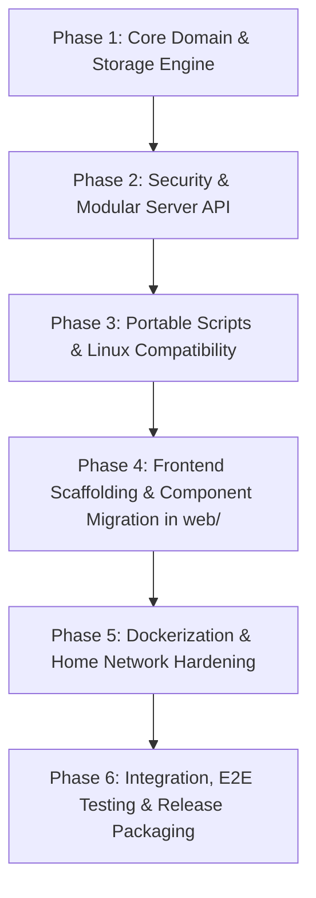

# Life Brain — Master Execution Specification & Agent Implementation Blueprint

> **Target Repository:** [`life-brain-starter`](./) (Base Branch: `master`)  
> **Document Purpose:** Consolidated, authoritative single source of truth for an autonomous AI coding agent to execute the full refactoring, security hardening, Dockerization, and React/TypeScript modernization of Life Brain starting from the clean `master` branch.  

---

## 1. Baseline Context & Invariant Guardrails

### 1.1 The Starting Baseline (`master`)

Starting from `master`, the repository is a pure desktop-oriented setup:

- **Scripts:** Monolithic scripts ([build.py](brain/tools/build.py) 14.8k LOC, [serve.py](brain/tools/serve.py) 4.3k LOC, [model.py](brain/tools/model.py) 2k LOC).
- **Environment:** No Docker files exist yet (`Dockerfile`, `docker-compose.yml`, and `docker/` are not on `master`).
- **Platform Coupling:** [morning.sh](brain/tools/morning.sh) and [night.sh](brain/tools/night.sh) are written in `zsh` with macOS-specific calls (`osascript`, `pmset`, `${0:A}`). [calendar_write.py](brain/tools/calendar_write.py) relies exclusively on macOS AppleScript.
- **Frontend:** Server-generated static HTML with vanilla JS and CSS inlined as raw Python string literals.

### 1.2 Non-Negotiable Invariants (Rules for the Implementing Agent)

1. **Zero Data Loss & Format Integrity:** Markdown files (`workstreams.md`, `people.md`, `today.md`, `habits.md`, `goals.md`, `season.md`, `config.json`) are the single source of truth. Their syntax, headings, and field formats must **never** be broken or altered.
2. **Backwards-Compatible Entrypoints:** Existing desktop entrypoint commands must continue to work seamlessly:
   - `python3 brain/tools/serve.py`
   - `python3 brain/tools/build.py`
   - `python3 brain/tools/check.py`
   - `python3 brain/tools/selftest.py`
   - `Open Brain.command` and `Open Brain.bat`
3. **Zero-Node Runtime on Desktop:** Desktop users running the Python launchers with standard Python 3 must **never** be forced to install Node.js. Production frontend builds are pre-compiled into `brain/dist/` and served statically by Python.
4. **Verification at Every Step:** `python3 brain/tools/check.py` and `python3 brain/tools/selftest.py` must pass with zero errors after every single phase.
5. **Decoupled Engine vs. Vault Architecture:** Application code (public, stateless engine) and personal notes/data (private, stateful vault) are strictly decoupled. The engine defaults the user's data vault to `~/brain-vault`. Path resolution follows strict precedence: `--vault <path>` CLI flag &rarr; `BRAIN_VAULT` env var &rarr; `./brain` (backwards compatibility if `workstreams.md` is present in CWD) &rarr; `~/brain-vault` (standard global default). On first run, an empty vault is bootstrapped with starter templates and initialized as an independent private Git repository.
6. **Headless & Non-Blocking Secrets:** In Docker and headless server environments lacking a desktop D-Bus SecretService, tools and credential helpers must check direct environment variables (`ANTHROPIC_API_KEY`, `EMAIL_APP_PASSWORD`, `TELEGRAM_BOT_TOKEN`, `GUARDIAN_API_KEY`, `BEEPER_TOKEN`, `BEEPER_API`) first, and must never block waiting on interactive stdin for `keyring`.
7. **First-Class Mobile PWA Support:** The web frontend must be an installable Progressive Web App (PWA) on iOS and Android (`display: standalone`, manifest, service worker caching for static assets/fonts/tokens, `apple-touch-icon`, `viewport-fit=cover`, and mobile-responsive layout with bottom navigation on phone viewports).

---

## 2. Target File Tree Structure

The implementing agent must construct the following directory architecture starting from `master`:

```
life-brain-starter/
├── brain/
│   ├── core/                        # [NEW] Pure Domain Logic, Typing & Persistence
│   │   ├── __init__.py
│   │   ├── vault.py                 # [NEW] Central vault path resolver & bootstrap engine (defaults to ~/brain-vault)
│   │   ├── models/                  # Strongly typed dataclasses
│   │   │   ├── __init__.py
│   │   │   ├── task.py              # Task, DueSpec, TimeEstimate
│   │   │   ├── workstream.py        # Workstream, BallState, DecayScore
│   │   │   ├── person.py            # Person, Circle, RelationshipWarmth
│   │   │   ├── habit.py             # Habit, HabitTarget, HabitLog
│   │   │   └── config.py            # ConfigSchema, AppearanceSettings
│   │   ├── parser/                  # Single source of truth for Markdown parsing
│   │   │   ├── __init__.py
│   │   │   ├── tokenizer.py         # Suffix regexes (due, waiting, est, with, fits)
│   │   │   ├── workstreams_parser.py# workstreams.md parser
│   │   │   ├── people_parser.py     # people.md parser
│   │   │   └── inline_md.py         # Markdown -> HTML inline renderer (from md.py)
│   │   ├── ranking/                 # Business logic & ranking algorithms
│   │   │   ├── __init__.py
│   │   │   ├── decay.py             # Coldness & chase calculation
│   │   │   ├── lead_time.py         # Lead time rules & start-by deadlines
│   │   │   └── priority.py          # Today's hero task ranking
│   │   └── storage/                 # Concurrency & file operations
│   │       ├── __init__.py
│   │       ├── file_store.py        # Atomic writes with fcntl.flock on vault lock file
│   │       └── git_ops.py           # Git snapshotting & safe directory handling
│   │
│   ├── server/                      # [NEW] Modular Web Server & API Controllers
│   │   ├── __init__.py
│   │   ├── app.py                   # HTTP server & static file dispatcher
│   │   ├── router.py                # Declarative Route registry
│   │   ├── middleware/              # Security & Auth pipeline
│   │   │   ├── __init__.py
│   │   │   ├── guard.py             # DNS rebinding protection & Origin CSRF checks
│   │   │   ├── auth.py              # Token/PIN authentication for LAN access
│   │   │   └── context.py           # Optimistic response deferral
│   │   └── controllers/             # REST & SSE JSON controllers
│   │       ├── __init__.py
│   │       ├── tasks_controller.py  # /api/tick, /api/touch, /api/ball, /api/ws/*
│   │       ├── people_controller.py # /api/person/*, /api/circle/*, /api/beeper/*
│   │       ├── views_controller.py  # /api/today, /api/workstreams, /api/news, /api/season
│   │       ├── agent_controller.py  # /api/agent, process supervisor, live feed
│   │       ├── sessions_controller.py# /api/sessions/*, interactive multi-agent feeds
│   │       └── files_controller.py  # Uploads, voice memos, transcriptions
│   │
│   ├── dist/                        # [NEW / GENERATED] Compiled React + TypeScript bundle
│   │   ├── index.html
│   │   └── assets/
│   │
│   └── tools/                       # Preserved CLI Wrappers & Integrations
│       ├── serve.py                 # Thin launcher calling brain.server.app
│       ├── build.py                 # Wrapper maintaining legacy HTML generation
│       ├── model.py                 # Backwards-compatible facade re-exporting brain.core
│       ├── morning.sh               # Converted to portable bash (Docker/Linux compatible)
│       ├── night.sh                 # Converted to portable bash (Docker/Linux compatible)
│       ├── check.py                 # Mechanical integrity linter
│       ├── selftest.py              # Smoke test suite
│       └── ...                      # Integrations: beeper, telegram, news, transcribe
│
├── web/                             # [NEW] Modern React + TypeScript SPA Frontend
│   ├── package.json
│   ├── tsconfig.json
│   ├── vite.config.ts               # Outputs directly to ../brain/dist/
│   ├── index.html
│   └── src/
│       ├── api/                     # Typed REST & SSE fetchers
│       ├── types/                   # TypeScript interfaces (Task, Workstream, Person, etc.)
│       ├── components/              # Reusable UI cards, chips, decay bars
│       ├── views/                   # TodayView, PlateView, PeopleView, SeasonView, MapView, ClaudeView
│       ├── styles/                  # CSS tokens matching Workroom/Bauhaus themes
│       └── App.tsx                  # Root layout, routing, optimistic state
│
├── docker/                          # [NEW] Docker & Scheduling Assets
│   ├── entrypoint.sh                # Permission handling & bootstrap cloning
│   ├── crontab                      # Supercronic schedule (07:00 morning, 01:00 night)
│   └── PORTAINER.md                 # Portainer stack deployment guide
├── Dockerfile                       # [NEW] Multi-stage build (builds web/ into brain/dist/)
├── docker-compose.yml               # [NEW] Hardened 2-container stack (web + cron)
├── pyproject.toml                   # [NEW] Modern PEP 621 package & dependency specification
└── .env.example                     # [NEW] Environment template with auth and host configuration
```

---

## 3. Phased Implementation Plan for the Agent

The implementing agent must execute the transformation from `master` across **6 sequential phases**.



---

### Phase 1: Core Domain, Parser Unification & Storage Engine

#### 1.1 Objectives

- Eliminate regex duplication between [model.py](brain/tools/model.py) and [md.py](brain/tools/md.py).
- Implement strongly typed domain models using Python `dataclasses(slots=True)`.
- Replace in-memory threading locks with cross-process `fcntl.flock` file locking.

#### 1.2 Tasks

1. **Create `brain/core/parser/tokenizer.py`:**
   - Centralize all suffix regexes: `UNTIL`, `DROPPED`, `CARRYING`, `EST`, `URGENT`, `WITH`, `WHEN`, `PLANNED`, `FITS`, `REPEAT`, `DID`.
   - Export `bare_task_text(text: str) -> str` and `compute_task_key(bare: str) -> str`.
   - Update `md.py` to import these patterns directly from `brain.core.parser.tokenizer`.
2. **Create `brain/core/models/`:**
   - `task.py`: Define `DueSpec` and `Task`.
   - `workstream.py`: Define `Workstream` and `BallState`.
   - `person.py`: Define `Person` and `Circle`.
   - `config.py`: Define `ConfigSchema` and appearance settings.
3. **Create `brain/core/storage/file_store.py`:**
   - Implement `locked_store(write: bool = False)` context manager using `fcntl.flock` on vault lock file (`.brain.lock`).
   - Implement `atomic_write(path: str, content: str)` with Windows `PermissionError` backoff retry loop.
4. **Create `brain/core/vault.py` (Decoupled Vault Engine):**
   - Implement `resolve_vault_path(cli_override)` following precedence: `--vault <path>` -> `BRAIN_VAULT` env -> `./brain` fallback -> `~/brain-vault` default.
   - Implement `Vault` class encapsulating root and standard paths (`workstreams_file`, `people_file`, `today_file`, `config_file`, `journal_dir`, `lock_file`).
   - Implement `Vault.bootstrap()` to populate fresh vaults from starter templates and run `git init` on first run.
5. **Refactor [brain/tools/model.py](brain/tools/model.py):**
   - Delegate parsing, storage, and models to `brain.core` and `get_vault()`, maintaining all existing public function signatures (`load()`, `parse()`, `load_people()`, `parse_due()`, `decay()`).

#### 1.3 Verification Gate 1

```bash
python3 -m py_compile brain/core/**/*.py
python3 brain/tools/selftest.py
python3 brain/tools/check.py
```

*Criteria:* All 51 selftest checks must pass; `check.py` must report "the brain is sound".

---

### Phase 2: Security Hardening & Modular Server API

#### 2.1 Objectives

- Fix static file DNS rebinding vulnerability in [serve.py](brain/tools/serve.py).
- Fix `Origin: null` CSRF bypass in `request_is_own()`.
- Add `BRAIN_ALLOWED_HOSTS` support so server can bind to `0.0.0.0` securely.
- Add optional `BRAIN_AUTH_TOKEN` authentication and `X-Forwarded-User` reverse proxy identity support.
- Replace procedural waterfall routing with declarative `Router` and JSON controllers (`/api/today`, `/api/workstreams`, `/api/news`, `/api/season`).

#### 2.2 Tasks

1. **Create `brain/server/middleware/guard.py`:**
   - Implement `HostOriginGuard.verify(headers, allowed_hosts)`:
     - Check `Host` header against `ALLOWED_HOSTS | EXTRA_HOSTS` (from `BRAIN_ALLOWED_HOSTS`).
     - Check `Origin` header; **reject** if `origin.lower() == "null"` or if host is not in allowed hosts.
2. **Create `brain/server/middleware/auth.py`:**
   - If `BRAIN_AUTH_TOKEN` is set in environment:
     - Check `Authorization: Bearer <token>` or Cookie `brain_token=<token>`.
     - Check reverse proxy header `X-Forwarded-User` or `Remote-User`.
     - If unauthorized, respond with HTTP 401.
3. **Create `brain/server/router.py`:**
   - Implement declarative routing table supporting HTTP methods (`GET`, `POST`) and regex path parameters.
4. **Create `brain/server/controllers/`:**
   - `tasks_controller.py`: Checkbox toggling (`/api/tick`), ball handoffs (`/api/ball`), timestamps (`/api/touch`), snoozing.
   - `views_controller.py`: JSON endpoints returning domain data for `/api/today`, `/api/workstreams`, `/api/people`, `/api/season`, `/api/news`.
   - `agent_controller.py`: `/api/agent`, `/api/agent/stop`, process supervisor with SSE live feeds.
   - `sessions_controller.py`: Multi-agent conversation feeds and doc rendering.
   - `integrations_controller.py`: `/api/status/ha` (Home Assistant status sensors) and `/api/capture` (token-authenticated webhook appending to `inbox.md`).
5. **Update [brain/tools/serve.py](brain/tools/serve.py):**
   - In `do_GET`: **Call `_guard()` and `_auth()` as the very first step before ANY path evaluation or static file serving.**
   - Delegate `/api/*` requests to the `Router`.
   - If `brain/dist/` exists, serve static React assets with client-side routing fallback; otherwise fall back to legacy `index.html`.

#### 2.3 Verification Gate 2

```bash
python3 brain/tools/selftest.py
python3 brain/tools/check.py
# Verify DNS rebinding rejection on static files
curl -s -H "Host: evil.com" http://127.0.0.1:7718/config.json | grep -v "owner"
# Verify Origin: null rejection on POST
curl -s -X POST -H "Origin: null" http://127.0.0.1:7718/api/tick | grep -i "refused"
```

*Criteria:* Host header spoofing and `Origin: null` return HTTP 403. Selftest passes.

---

### Phase 3: Portable Scripts & Linux Compatibility

#### 3.1 Objectives

- Convert macOS-only `zsh` background scripts into portable `bash` scripts compatible with Linux, Docker, and macOS.
- Remove hard dependencies on `osascript` and `pmset` in non-Mac environments.
- Prepare automated Git commit and push handling.

#### 3.2 Tasks

1. **Port [brain/tools/morning.sh](brain/tools/morning.sh):**
   - Change shebang to `#!/usr/bin/env bash`.
   - Replace zsh `${0:A:h:h:h}` symlink resolution with portable bash readlink loop:

     ```bash
     SELF="$0"
     while [ -L "$SELF" ]; do
       LINKDIR="$(cd "$(dirname "$SELF")" && pwd -P)"
       SELF="$(readlink "$SELF")"
       case "$SELF" in /*) ;; *) SELF="$LINKDIR/$SELF" ;; esac
     done
     BRAIN_DIR="$(cd "$(dirname "$SELF")/../.." && pwd -P)"
     ```

   - Gate `osascript` notifications behind `command -v osascript >/dev/null 2>&1`.
   - Ensure git push handles missing credentials gracefully without blocking:

     ```bash
     git push -q origin HEAD >> "$LOG" 2>&1 || echo "push failed (offline?)" >> "$LOG"
     ```

2. **Port [brain/tools/night.sh](brain/tools/night.sh):**
   - Change shebang to `#!/usr/bin/env bash` with same portable path resolution.
   - Replace zsh `(N)` glob qualifiers with explicit `[ -d "$d" ]` checks.
   - Gate `pmset` battery check behind `command -v pmset >/dev/null 2>&1`.
3. **Port Setup Scripts:**
   - Update `setup_morning.sh` and `setup_night.sh` to use portable bash.

#### 3.3 Verification Gate 3

```bash
bash -n brain/tools/morning.sh
bash -n brain/tools/night.sh
python3 brain/tools/selftest.py
```

*Criteria:* Syntax check passes cleanly under bash; selftest passes.

---

### Phase 4: Frontend Foundation & Component Migration (`web/`)

#### 4.1 Objectives

- Scaffold the `web/` Vite + React + TypeScript workspace.
- Configure Vite to compile directly into `brain/dist/`.
- Establish CSS design tokens and layout matching Workroom/Bauhaus aesthetic.
- Implement responsive React views with optimistic UI updates.
- Implement first-class **Mobile Progressive Web App (PWA)**: installable on iOS & Android, standalone display mode, offline asset caching via service worker, touch icons, and mobile bottom navigation with safe-area insets.

#### 4.2 Tasks

1. **Initialize `web/` Workspace & PWA Plugin:**

   ```bash
   npx -y create-vite@latest web --template react-ts
   cd web && npm install
   npm install -D vite-plugin-pwa
   ```

2. **Configure `web/vite.config.ts` & PWA Manifest:**
   - Set build output to `path.resolve(__dirname, '../brain/dist')` with `emptyOutDir: true`.
   - Set up API proxy to `http://127.0.0.1:7718`.
   - Configure `VitePWA`:
     - Register type: `autoUpdate`.
     - Manifest: `display: standalone`, `orientation: portrait`, `theme_color: #f4efe6`, `background_color: #f4efe6`.
     - Icons: 192x192, 512x512, and maskable icons.
     - Workbox caching: cache static bundles, Google/local fonts (`.woff2`), and CSS tokens.
3. **Configure `web/index.html` Mobile Shell:**
   - `<meta name="viewport" content="width=device-width, initial-scale=1.0, viewport-fit=cover">` (avoids accessibility-breaking `user-scalable=no`)
   - `<meta name="theme-color" content="#f4efe6">`
   - `<link rel="manifest" href="/manifest.webmanifest">`
   - `<link rel="icon" type="image/png" sizes="192x192" href="/logo-192.png">`
   - *Note on deprecations:* Standalone window mode, theme colors, and icons are now standardized directly inside `manifest.webmanifest` (`display: standalone`). Obsolete vendor tags (`apple-mobile-web-app-capable`, `apple-mobile-web-app-status-bar-style`) are omitted to avoid Chrome/Lighthouse deprecation warnings. Modern iOS Safari (iOS 16.4+) fully adheres to W3C Web App Manifest standards.
4. **Establish Design Tokens & Types:**
   - Port CSS variables (`--paper`, `--ink`, `--olive`, `--terra`, `--line`) into `web/src/styles/tokens.css`.
   - Create TypeScript definitions in `web/src/types/` (`Task`, `Workstream`, `Person`, `NewsItem`, `SessionConvo`).
5. **Implement UI Views & Mobile Navigation:**
   - **`TodayView.tsx`:** Ranked #1 hero card, week strip, today's checkboxes, habit rail.
   - **`PlateView.tsx`:** Decay-ranked workstreams, SVG decay bars, ball handoff chip, snooze modal.
   - **`PeopleView.tsx`:** Grouped by circle, drift indicators, hold/unhold dates.
   - **`SeasonView.tsx`:** Bucket list with drag-and-drop chips using `@hello-pangea/dnd`.
   - **`NewsView.tsx`:** Daily briefing articles, read minutes, and speed-read drawer.
   - **`MapView.tsx`:** Interactive graph implemented with `@xyflow/react` (React Flow).
   - **`ClaudeView.tsx`:** Live streaming SSE terminal for Claude Code runs.
   - **`MobileNav.tsx`:** Fixed bottom navigation tab bar on `<768px` viewports with `env(safe-area-inset-bottom)` padding for iOS gesture bars.

#### 4.3 Verification Gate 4

```bash
cd web && npm run build
python3 brain/tools/check.py
```

*Criteria:* Vite builds with 0 TypeScript errors into `brain/dist/`; PWA manifest and service worker generated in `brain/dist/`; opening `http://127.0.0.1:7718/` serves the React PWA frontend; ticking tasks updates `workstreams.md` via API.

---

### Phase 5: Dockerization & Home Network Hardening

#### 5.1 Objectives

- Create the multi-stage [Dockerfile](Dockerfile) building both the React frontend and the Python/Node runtime.
- Create [docker-compose.yml](docker-compose.yml) running the 2-container architecture (`life-brain` web + `life-brain-cron` scheduler).
- Create entrypoint script ([docker/entrypoint.sh](docker/entrypoint.sh)) handling user permissions, host volume ownership, and bootstrap cloning.
- Create [docker/crontab](docker/crontab) running morning (07:00) and night (01:00) jobs via `supercronic`.
- Create [.env.example](.env.example) and [docker/PORTAINER.md](docker/PORTAINER.md).

#### 5.2 Tasks

1. **Create [Dockerfile](Dockerfile):**
   - Stage 1 (`frontend-builder`): Compiles `web/` into `/app/dist`.
   - Stage 2 (`runtime`): `node:22-bookworm-slim` + Python 3.11, Claude Code CLI, `supercronic`, and `gosu`.
   - Copy engine code to `/app` and `/app/dist` into `/app/brain/dist`.
   - Add optional build arg `WITH_WHISPER=false` for faster-whisper.
   - Add optional build arg `WITH_BROWSER=false` for Chromium Playwright dependencies.
   - Support `WHISPER_API_URL` environment variable for offloading transcription to external Whisper services on low-power servers.
2. **Create [docker/entrypoint.sh](docker/entrypoint.sh):**
   - Run as root to check ownership of `/vault`.
   - If `/vault` is root-owned (common with Docker bind mounts), adopt ownership to target `UID:GID`.
   - If `/vault` is empty, run `Vault.bootstrap()` to seed starter files and `git init`.
   - Drop privileges to `UID:GID` via `gosu` before executing CMD.
3. **Create [docker/crontab](docker/crontab):**

   ```cron
   0 7 * * * cd /vault && python3 -m brain.tools.morning
   0 1 * * * cd /vault && python3 -m brain.tools.night
   ```

4. **Create [docker-compose.yml](docker-compose.yml):**
   - Define `brain` and `cron` services.
   - Expose port `7718`.
   - Mount persistent vault volume: `${VAULT_DIR:-~/brain-vault}:/vault`.
   - Mount named volume for `claude-auth`.
   - Add optional SSH key mounting: `${HOME}/.ssh:/home/brain/.ssh:ro`.
   - Pass `BRAIN_VAULT: "/vault"` and `WHISPER_API_URL: ${WHISPER_API_URL:-}`.
   - Support **Tailnet Trust Model**: For users accessing via Tailscale + Traefik, `BRAIN_AUTH_TOKEN` is left unset, allowing Tailscale device authentication to secure access with zero password prompts.
   - Add Traefik routing labels (`traefik.http.routers.brain.rule=Host(...)`).
   - Set `cron` to depend on `brain` with `condition: service_healthy`.
5. **Traefik + Tailscale Reverse Proxy Configuration:**
   - Configure Traefik routing with Tailscale MagicDNS labels (`.ts.net`), enabling automatic Let's Encrypt TLS certificates, mobile browser microphone recording, and PWA installation with zero password friction.
6. **Create [.env.example](.env.example) and [docker/PORTAINER.md](docker/PORTAINER.md).**

#### 5.3 Verification Gate 5

```bash
docker compose build
docker compose up -d
docker compose ps
docker exec life-brain curl -fsS http://127.0.0.1:7718/api/today
```

*Criteria:* Both containers launch healthy; API responds; supercronic runs in cron container.

---

### Phase 6: Integration, E2E Testing & Release Packaging

#### 6.1 Objectives

- Deprecate monolithic string generation in [build.py](brain/tools/build.py) in favor of the Vite pre-compiled frontend.
- Provide standard Python packaging via `pyproject.toml` (PEP 621) and deprecate legacy scrubbing tools (`share.py`, `update.py`).
- Create comprehensive automated test suite covering vault discovery, APIs, security guardrails, and parsing parity.
- Update documentation ([README.md](README.md)).

#### 6.2 Tasks

1. **Update [brain/tools/build.py](brain/tools/build.py):**
   - Turn `build.py` into a thin coordinator: if `web/` exists and Node is available, run `npm run build`; otherwise ensure `brain/dist/` is valid and present.
   - Accept `--vault <path>` CLI flag.
2. **Create [pyproject.toml](pyproject.toml) & Packaging:**
   - Define modern PEP 621 metadata, dependencies, and optional extras (`windows`, `linux`, `audio`, `dev`).
   - Deprecate `share.py` and `update.py`: In the decoupled model, application updates are standard `git pull` or `docker compose pull`, and personal life notes are stored in `~/brain-vault` rather than commingled with code.
3. **Add Automated Test Suite (`tests/`):**
   - `test_vault.py`: Test path resolution precedence (`--vault` -> `BRAIN_VAULT` -> `./brain` -> `~/brain-vault`), template bootstrapping, and Git repository initialization.
   - `test_api.py`: Test `/api/today`, `/api/tick`, `/api/workstreams`, `/api/news`.
   - `test_security.py`: Verify DNS rebinding rejection, `Origin: null` rejection, and token authentication.
   - `test_parser.py`: Verify tokenizer and bare hashing parity.
4. **Update Documentation:**
   - Document Docker deployment, reverse proxy setup, and the decoupled `~/brain-vault` workflow in [README.md](README.md).

#### 6.3 Final Acceptance Gate

```bash
python3 brain/tools/selftest.py
python3 brain/tools/check.py
pytest tests/
```

*Criteria:* 100% test pass rate; zero regressions; Docker deployment verified end-to-end.

---

## 4. Key Implementation Reference Code

### 4.1 Cross-Process File Lock (`brain/core/storage/file_store.py`)

```python
import fcntl
import os
import time
from contextlib import contextmanager

LOCK_PATH = "brain/.brain.lock"

@contextmanager
def locked_store(exclusive: bool = True):
    """File lock shared across serve.py, supercronic, and CLI scripts."""
    flags = fcntl.LOCK_EX if exclusive else fcntl.LOCK_SH
    with open(LOCK_PATH, "a") as f:
        fcntl.flock(f.fileno(), flags)
        try:
            yield
        finally:
            fcntl.flock(f.fileno(), fcntl.LOCK_UN)

def atomic_write(path: str, text: str) -> None:
    """Atomic write with Windows PermissionError exponential retry."""
    tmp = f"{path}.tmp.{os.getpid()}"
    with open(tmp, "w", encoding="utf-8") as f:
        f.write(text)
    
    for attempt in range(5):
        try:
            os.replace(tmp, path)
            return
        except PermissionError:
            time.sleep(0.05 * (2 ** attempt))
    os.replace(tmp, path)
```

### 4.2 Security & Origin Guard Middleware (`brain/server/middleware/guard.py`)

```python
def request_is_own(host_header: str, origin_header: str, allowed_hosts: set[str]) -> bool:
    """Validate Host and Origin headers. Rejects DNS rebinding and null origins."""
    if host_header:
        host = host_header.split(":")[0].strip().lower()
        if host not in allowed_hosts:
            return False

    if origin_header:
        origin = origin_header.strip()
        # CRITICAL: Reject sandboxed iframes & data URIs
        if origin.lower() == "null":
            return False
        bare_origin = origin.split("://")[-1].split("/")[0].split(":")[0].lower()
        if bare_origin not in allowed_hosts:
            return False

    return True
```

### 4.3 Multi-Stage Dockerfile Blueprint (`Dockerfile`)

```dockerfile
# Stage 1: Compile React + TypeScript Frontend
FROM node:22-bookworm-slim AS frontend-builder
WORKDIR /app
COPY web/package*.json ./
RUN npm ci
COPY web/ ./
RUN npm run build

# Stage 2: Production Server Runtime
FROM node:22-bookworm-slim
RUN apt-get update && apt-get install -y --no-install-recommends \
        python3 python3-venv git tzdata ca-certificates curl procps gosu \
    && rm -rf /var/lib/apt/lists/*

RUN npm install -g @anthropic-ai/claude-code && npm cache clean --force

# Install supercronic for non-root scheduling
ARG SUPERCRONIC_VERSION=v0.2.49
RUN curl -fsSL -o /usr/local/bin/supercronic \
        "https://github.com/aptible/supercronic/releases/download/${SUPERCRONIC_VERSION}/supercronic-linux-amd64" \
    && chmod +x /usr/local/bin/supercronic

ENV VIRTUAL_ENV=/opt/venv
ENV PATH="$VIRTUAL_ENV/bin:$PATH"
RUN python3 -m venv "$VIRTUAL_ENV" && pip install --no-cache-dir keyring keyrings.alt

WORKDIR /app

# Copy application engine code and compiled React frontend into runtime directory
COPY . /app
COPY --from=frontend-builder /app/dist /app/brain/dist
COPY --chmod=0755 docker/entrypoint.sh /usr/local/bin/brain-entrypoint

EXPOSE 7718
ENTRYPOINT ["/usr/local/bin/brain-entrypoint"]
CMD ["python3", "-m", "brain.server.app", "--vault", "/vault"]
```

### 4.4 Central Vault Resolver & Auto-Bootstrap Module (`brain/core/vault.py`)

```python
"""Central path resolver and bootstrap engine for the Life Brain Vault."""

import argparse
import os
import shutil
import subprocess
import sys
from pathlib import Path
from typing import Optional

DEFAULT_VAULT_PATH = Path.home() / "brain-vault"
STARTER_TEMPLATES = Path(__file__).resolve().parent.parent / "tools" / "share-templates"

class Vault:
    def __init__(self, root: Path):
        self.root = root.resolve()
        self.config_file = self.root / "config.json"
        self.workstreams_file = self.root / "workstreams.md"
        self.people_file = self.root / "people.md"
        self.today_file = self.root / "today.md"
        self.journal_dir = self.root / "journal"
        self.queue_dir = self.root / "queue"
        self.rooms_dir = self.root / "rooms"
        self.drafts_dir = self.root / "drafts"
        self.lock_file = self.root / ".brain.lock"

    def path(self, *parts: str) -> Path:
        """Resolve a relative path inside the vault."""
        return self.root.joinpath(*parts)

    def is_initialized(self) -> bool:
        return self.workstreams_file.is_file() and self.config_file.is_file()

    def bootstrap(self) -> None:
        """Initialize a fresh vault with starter templates and git repo."""
        if self.is_initialized():
            return

        self.root.mkdir(parents=True, exist_ok=True)
        for d in ("journal", "queue", "rooms", "drafts", "avatars", "files", "transcripts", "finance"):
            (self.root / d).mkdir(parents=True, exist_ok=True)

        # Copy starter templates
        if STARTER_TEMPLATES.is_dir():
            for item in STARTER_TEMPLATES.glob("*"):
                target = self.root / item.name
                if not target.exists():
                    if item.is_file():
                        shutil.copy2(item, target)
                    elif item.is_dir():
                        shutil.copytree(item, target)

        # Initialize local git repository if not present
        git_dir = self.root / ".git"
        if not git_dir.exists():
            try:
                subprocess.run(["git", "init"], cwd=str(self.root), check=True, capture_output=True)
                subprocess.run(["git", "add", "-A"], cwd=str(self.root), check=True, capture_output=True)
                subprocess.run(["git", "commit", "-m", "chore: initialize life brain vault"],
                               cwd=str(self.root), check=True, capture_output=True)
            except Exception as e:
                sys.stderr.write(f"Warning: Git initialization in vault failed: {e}\n")


_ACTIVE_VAULT: Optional[Vault] = None

def resolve_vault_path(cli_override: Optional[str] = None) -> Path:
    """Resolve active vault directory path based on precedence rules."""
    # 1. CLI Override
    if cli_override:
        return Path(cli_override).expanduser()

    # 2. Environment Variable
    env_path = os.environ.get("BRAIN_VAULT") or os.environ.get("BRAIN_DIR")
    if env_path:
        return Path(env_path).expanduser()

    # 3. Local Legacy Fallback (CWD contains brain/workstreams.md)
    cwd_local = Path.cwd() / "brain"
    if (cwd_local / "workstreams.md").is_file():
        return cwd_local

    # 4. Standard Global Default: ~/brain-vault
    return DEFAULT_VAULT_PATH


def get_vault(cli_override: Optional[str] = None) -> Vault:
    """Get or initialize the global active Vault instance."""
    global _ACTIVE_VAULT
    if _ACTIVE_VAULT is None or cli_override is not None:
        vault_path = resolve_vault_path(cli_override)
        vault = Vault(vault_path)
        if not vault.is_initialized():
            vault.bootstrap()
        _ACTIVE_VAULT = vault
    return _ACTIVE_VAULT
```

### 4.5 Decoupled `docker-compose.yml` Blueprint

```yaml
services:
  brain:
    build:
      context: .
      args:
        UID: ${UID:-1000}
        GID: ${GID:-1000}
    image: life-brain:latest
    container_name: life-brain
    command: ["python3", "-m", "brain.server.app", "--vault", "/vault"]
    environment:
      BRAIN_VAULT: "/vault"
      BRAIN_BIND: "0.0.0.0"
      BRAIN_PORT: "7718"
      BRAIN_ALLOWED_HOSTS: ${BRAIN_ALLOWED_HOSTS:-localhost,127.0.0.1}
      BRAIN_AUTH_TOKEN: ${BRAIN_AUTH_TOKEN:-}
      TZ: ${TZ:-Europe/Madrid}
      ANTHROPIC_API_KEY: ${ANTHROPIC_API_KEY:-}
    ports:
      - "${BRAIN_PORT:-7718}:7718"
    # Optional Traefik + Tailscale Ingress (Zero-Password Tailnet Trust)
    # labels:
    #   - "traefik.enable=true"
    #   - "traefik.http.routers.brain.rule=Host(`${BRAIN_HOSTNAME:-brain.tailnet.ts.net}`)"
    #   - "traefik.http.routers.brain.entrypoints=websecure"
    #   - "traefik.http.services.brain.loadbalancer.server.port=7718"
    volumes:
      # ONLY your personal notes and history are mounted!
      - ${VAULT_DIR:-~/brain-vault}:/vault
      - claude-auth:/home/brain/.claude
      # Optional: SSH key for pushing vault git commits to private remote
      - ${HOME}/.ssh:/home/brain/.ssh:ro
    restart: unless-stopped
    healthcheck:
      test: ["CMD", "curl", "-fsS", "-o", "/dev/null", "http://127.0.0.1:7718/api/today"]
      interval: 30s
      timeout: 5s
      retries: 3

  cron:
    image: life-brain:latest
    container_name: life-brain-cron
    command: ["supercronic", "-passthrough-logs", "/app/docker/crontab"]
    environment:
      BRAIN_VAULT: "/vault"
      TZ: ${TZ:-Europe/Madrid}
      ANTHROPIC_API_KEY: ${ANTHROPIC_API_KEY:-}
    volumes:
      - ${VAULT_DIR:-~/brain-vault}:/vault
      - claude-auth:/home/brain/.claude
      - ${HOME}/.ssh:/home/brain/.ssh:ro
    restart: unless-stopped
    depends_on:
      brain:
        condition: service_healthy

volumes:
  claude-auth:
```

### 4.6 Traefik Reverse Proxy Configuration for Tailscale MagicDNS

When deploying behind Traefik on a Tailscale network, Traefik routes encrypted HTTPS traffic using your Tailscale MagicDNS domain (`.ts.net`):

```yaml
services:
  brain:
    # ...
    labels:
      - "traefik.enable=true"
      - "traefik.http.routers.brain.rule=Host(`${BRAIN_HOSTNAME:-brain.your-tailnet.ts.net}`)"
      - "traefik.http.routers.brain.entrypoints=websecure"
      - "traefik.http.routers.brain.tls=true"
      - "traefik.http.services.brain.loadbalancer.server.port=7718"
```

*Key Benefits:*

- **Automatic Valid TLS:** Tailscale issues valid Let's Encrypt certificates for your `*.ts.net` domain, completely eliminating browser security warnings.
- **Microphone Recording:** Mobile browsers (iOS Safari, Android Chrome) allow microphone access for voice dictation because `.ts.net` is recognized as a secure HTTPS origin.
- **Tailnet Trust:** Only devices authenticated into your private Tailscale network can reach Traefik, providing zero-password, frictionless 1-tap mobile PWA access without needing login screens.

### 4.7 Modern Vite Configuration Blueprint (`web/vite.config.ts`)

```typescript
import { defineConfig } from 'vite';
import react from '@vitejs/plugin-react';
import { VitePWA } from 'vite-plugin-pwa';
import path from 'path';

export default defineConfig({
  plugins: [
    react(),
    VitePWA({
      registerType: 'autoUpdate',
      includeAssets: ['logo-*.png', 'favicon.ico', 'fonts/*.woff2'],
      manifest: {
        name: 'Life Brain',
        short_name: 'Brain',
        description: 'Everything on your plate, ranked by what is decaying.',
        theme_color: '#f4efe6',
        background_color: '#f4efe6',
        display: 'standalone',
        orientation: 'portrait',
        scope: '/',
        start_url: '/',
        icons: [
          {
            src: 'logo-192.png',
            sizes: '192x192',
            type: 'image/png',
          },
          {
            src: 'logo-512.png',
            sizes: '512x512',
            type: 'image/png',
          },
          {
            src: 'logo-512.png',
            sizes: '512x512',
            type: 'image/png',
            purpose: 'maskable',
          },
        ],
      },
      workbox: {
        globPatterns: ['**/*.{js,css,html,ico,png,svg,woff2}'],
        runtimeCaching: [
          {
            urlPattern: /^\/api\/.*/,
            handler: 'NetworkFirst',
            options: {
              cacheName: 'api-cache',
              networkTimeoutSeconds: 3,
            },
          },
        ],
      },
    }),
  ],
  build: {
    // Output bundle directly into brain/dist/ so Python can serve it statically with 0 Node overhead
    outDir: path.resolve(__dirname, '../brain/dist'),
    emptyOutDir: true,
    sourcemap: false,
  },
  server: {
    port: 5173,
    proxy: {
      '/api': {
        target: 'http://127.0.0.1:7718',
        changeOrigin: true,
      },
    },
  },
});
```

### 4.8 Modern Packaging Blueprint (`pyproject.toml`)

```toml
[build-system]
requires = ["setuptools>=61.0"]
build-backend = "setuptools.build_meta"

[project]
name = "life-brain"
version = "2026.09.08"
description = "A second brain for your life admin — local-first, privacy-first."
readme = "README.md"
requires-python = ">=3.9"
dependencies = []

[project.optional-dependencies]
windows = ["keyring", "tzdata"]
linux = ["keyring", "SecretStorage"]
audio = ["faster-whisper"]
audio-mac = ["mlx-whisper"]
dev = ["pytest", "ruff", "mypy", "playwright"]
all = ["keyring", "tzdata", "faster-whisper", "pytest", "ruff"]

[project.scripts]
brain = "brain.server.app:main"
```

### 4.9 Vault Context Blueprint (`~/brain-vault/CLAUDE.md`)

```markdown
# Life Brain Vault

This directory is your personal life-admin vault.
The Life Brain engine tools are installed on your system.

- To run integrity checks: python3 -m brain.tools.check --vault .
- Commit before and after real work: git add -A && git commit
```

### 4.10 Canonical Tokenizer & Task Suffix Patterns (`brain/core/parser/tokenizer.py`)

```python
"""Canonical suffix regexes and task tokenization shared across parser, model, and UI."""

import hashlib
import re

# Canonical Task Suffix Regexes (MUST match across core.parser, model.py, and md.py)
UNTIL_RE = re.compile(r"\s*\(waiting until (\d{4}-\d{2}-\d{2})\)")
DROPPED_RE = re.compile(r"\s*\(dropped (\d{4}-\d{2}-\d{2})\)")
CARRYING_RE = re.compile(r"\s*\(carrying (\d{4}-\d{2}-\d{2})\)")
EST_RE = re.compile(r"\s*~\s*(\d+h\d*m?|\d+m)\b", re.I)
URGENT_RE = re.compile(r"\s*\(urgent\)", re.I)
WITH_RE = re.compile(r"\s*\(with ([^)]+)\)", re.I)
WHEN_RE = re.compile(r"\s*\(when ([^)]+)\)", re.I)
PLANNED_RE = re.compile(r"\s*\(planned ([^)]+)\)", re.I)
FITS_RE = re.compile(r"\s*\(fits ([^)]+)\)", re.I)
REPEAT_RE = re.compile(r"\s*\(every ([^)]+)\)", re.I)
DID_RE = re.compile(r"\s*\(did (\d{4}-\d{2}-\d{2})\)")

def bare_task_text(text: str) -> str:
    """Strip all dynamic state suffixes to produce stable hashing key."""
    t = text
    for r in (UNTIL_RE, DROPPED_RE, CARRYING_RE, EST_RE, URGENT_RE,
              WITH_RE, WHEN_RE, PLANNED_RE, FITS_RE, REPEAT_RE, DID_RE):
        t = r.sub("", t)
    return t.strip()

def compute_task_key(bare_text: str) -> str:
    """Compute deterministic short hash for checkbox toggling."""
    return hashlib.md5(bare_text.strip().lower().encode("utf-8")).hexdigest()[:12]
```

### 4.11 Core Domain Dataclasses Blueprint (`brain/core/models/`)

```python
# brain/core/models/task.py
from dataclasses import dataclass
from datetime import date
from typing import Optional

@dataclass(slots=True, frozen=True)
class DueSpec:
    start: date
    end: date
    fuzzy: bool
    label: str

@dataclass(slots=True)
class Task:
    raw_text: str
    clean_text: str
    key: str
    done: bool
    due: Optional[DueSpec] = None
    estimate_minutes: Optional[int] = None
    waiting_until: Optional[date] = None
    dropped: Optional[date] = None
    urgent: bool = False
    with_person: Optional[str] = None
    planned_date: Optional[date] = None
```

```python
# brain/core/models/workstream.py
from dataclasses import dataclass, field
from datetime import date
from typing import Optional
from .task import Task

@dataclass(slots=True)
class Workstream:
    name: str
    status: str              # moving, stalled, blocked, waiting, not started, etc.
    ball: str                # me, them, nobody
    since: Optional[date] = None
    touched: Optional[date] = None
    due: Optional[str] = None
    why: str = ""
    next_action: str = ""
    tasks: list[Task] = field(default_factory=list)

    @property
    def open_tasks(self) -> list[Task]:
        return [t for t in self.tasks if not t.done and not t.dropped]
```

### 4.12 Headless Secrets & Credential Helper Pattern

```python
import os
import sys
from typing import Optional

def get_secret(key: str, env_var: Optional[str] = None) -> Optional[str]:
    """Retrieve secret from environment variable first, falling back to keyring safely."""
    var_name = env_var or key.upper()
    val = os.environ.get(var_name)
    if val:
        return val.strip()

    # If headless (no TTY or running in Docker), avoid blocking on interactive keyring prompt
    if not sys.stdin.isatty() or os.environ.get("BRAIN_VAULT") == "/vault":
        try:
            import keyring
            return keyring.get_password("life-brain", key)
        except Exception:
            return None

    try:
        import keyring
        return keyring.get_password("life-brain", key)
    except Exception:
        return None
```

### 4.13 Production Docker Entrypoint (`docker/entrypoint.sh`)

```sh
#!/bin/sh
set -eu

VAULT=/vault
UID_T="${UID:-1000}"
GID_T="${GID:-1000}"

mkdir -p "$VAULT"
OWNER="$(stat -c '%u' "$VAULT" 2>/dev/null || stat -f '%u' "$VAULT" 2>/dev/null || echo 0)"

# Root-owned is what Docker leaves behind when creating a missing host bind mount.
# Adopt it to the requested runtime UID:GID.
if [ "$OWNER" = "0" ] && [ "$UID_T" != "0" ]; then
    echo "  /vault is root-owned — adopting ownership as $UID_T:$GID_T."
    chown -R "$UID_T:$GID_T" "$VAULT"
fi

# If vault is empty, bootstrap starter templates and git repo
if [ -z "$(ls -A "$VAULT" 2>/dev/null)" ]; then
    echo "  /vault is empty — bootstrapping starter vault as $UID_T:$GID_T."
    gosu "$UID_T:$GID_T" python3 -c '
from brain.core.vault import get_vault
vault = get_vault("/vault")
print("Vault successfully bootstrapped.")
'
fi

exec gosu "$UID_T:$GID_T" "$@"
```

### 4.14 Homelab REST API Blueprint (`/api/status/ha` & `/api/capture`)

```python
# brain/server/controllers/integrations_controller.py
import os
from datetime import date
from brain.core.storage.file_store import locked_store, atomic_write
from brain.core.vault import get_vault

def get_ha_status(handler, **kwargs):
    """Return JSON formatted for Home Assistant REST sensors."""
    vault = get_vault()
    # Read core models and compute counts
    return {
        "state": "online",
        "date": date.today().isoformat(),
        "overdue_count": 0,    # computed overdue workstream count
        "chase_count": 0,      # computed contacts needing chase
        "today_hero": "Hero task title",
        "decay_score": 95,     # system freshness score
    }

def post_capture(handler, **kwargs):
    """Token-authenticated endpoint to append quick thoughts to inbox.md."""
    body = handler.read_json()
    text = body.get("text", "").strip()
    if not text:
        return {"ok": False, "error": "Empty text"}

    vault = get_vault()
    inbox_path = str(vault.path("inbox.md"))
    with locked_store(write=True):
        existing = ""
        if os.path.exists(inbox_path):
            with open(inbox_path, "r", encoding="utf-8") as f:
                existing = f.read()
        updated = existing.rstrip() + f"\n- [ ] {text} (captured {date.today().isoformat()})\n"
        atomic_write(inbox_path, updated)

    return {"ok": True}
```

### 4.15 Portainer Homelab Stack Specification (`docker/PORTAINER.md`)

```markdown
# Deploying Life Brain as a Portainer Stack

In Portainer: **Stacks → Add stack → Repository**.

| Field | Value |
|---|---|
| Repository URL | `https://github.com/albertonoys/life-brain-starter` |
| Reference | `refs/heads/master` |
| Compose path | `docker-compose.yml` |

### Environment Variables

| Name | Example | Why |
|---|---|---|
| `VAULT_DIR` | `/srv/life-brain-vault` | Absolute path on host holding your personal data vault. |
| `BRAIN_ALLOWED_HOSTS` | `192.168.1.50,brainbox.local` | Allowed Host headers for DNS rebinding protection. |
| `BRAIN_AUTH_TOKEN` | `your-secret-token` | Optional bearer token for LAN access. |
| `TZ` | `Europe/Madrid` | Local timezone for 07:00 morning and 01:00 night jobs. |
| `UID` | `1000` | User ID on the host server (`id -u`). |
| `GID` | `1000` | Group ID on the host server (`id -g`). |
| `BRAIN_PORT` | `7718` | Host port to expose. |
| `WITH_WHISPER` | `false` | Set to true only if running local faster-whisper ML models. |
| `WHISPER_API_URL` | `http://192.168.1.50:8000/v1` | Optional remote Whisper server URL. |

### First-Time Claude Authentication

Over SSH to the Docker host:
```bash
docker exec -it life-brain claude
```

Follow the prompt. Credentials are saved in the `claude-auth` persistent volume and persist across redeploys.

```

---

*Master Execution Specification compiled and saved to [MASTER_EXECUTION_PLAN.md](MASTER_EXECUTION_PLAN.md).*
